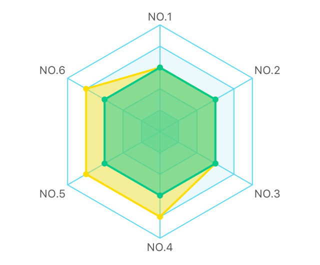
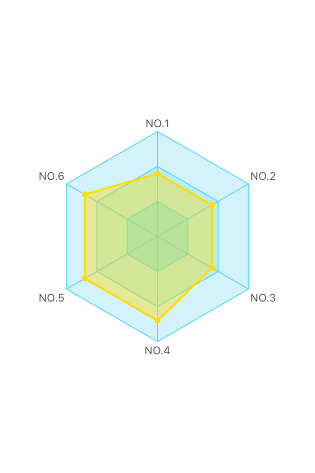
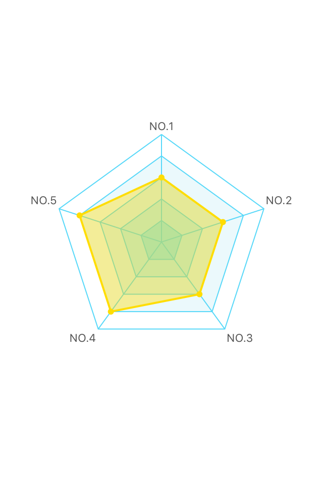
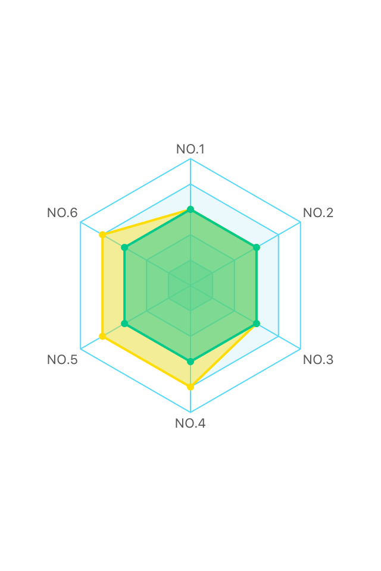

# TKRadarChart
> A customizable radar chart in Swift

[![Swift Version][swift-image]][swift-url]
[](https://raw.githubusercontent.com/TBXark/TKRadarChart/master/LICENSE)
[](http://cocoapods.org/?q= TKRadarChart)
[](http://cocoapods.org/?q= TKRadarChart)
[](https://github.com/Carthage/Carthage)
[](https://www.apple.com/nl/ios/)




## Requirements

- iOS 8.0+
- Xcode 8.0
- Swift 3.0

## Installation

#### CocoaPods
You can use [CocoaPods](http://cocoapods.org/) to install `TKRadarChart` by adding it to your `Podfile`:

```ruby
platform :ios, '8.0'
use_frameworks!
pod 'TKRadarChart'
```

To get the full benefits import `TKRadarChart` wherever you import UIKit

``` swift
import UIKit
import TKRadarChart
```
#### Carthage
Create a `Cartfile` that lists the framework and run `carthage update`. Follow the [instructions](https://github.com/Carthage/Carthage#if-youre-building-for-ios) to add `$(SRCROOT)/Carthage/Build/iOS/TKRadarChart.framework` to an iOS project.

```
github "tbxark/TKRadarChart"
```
#### Manually
1. Download and drop ```TKRadarChart.swift``` in your project.  
2. Congratulations!  

## Usage example

### Base

|Base|Description|Demo|
|---|---|---|
|Step|Background polygon laps(min 1)| |
|Row|Number of edges of polygon (min 3)| |
|Section|At the same time show the number of data| |

### TKRadarChartConfig

This structure is used for custom charts

```
    var radius: CGFloat    
    var minValue: CGFloat
    var maxValue: CGFloat

    var showPoint: Bool
    var showBorder: Bool
    var fillArea: Bool
    var clockwise: Bool
    var autoCenterPoint: Bool
```

### TKRadarChartDataSource

This protocol represents the data model object. as such, it supplies no information about appearance

```
protocol TKRadarChartDataSource: class {
    func numberOfStepForRadarChart(radarChart: TKRadarChart) -> Int
    func numberOfRowForRadarChart(radarChart: TKRadarChart) -> Int
    func numberOfSectionForRadarChart(radarChart: TKRadarChart) -> Int

    func titleOfRowForRadarChart(radarChart: TKRadarChart, row: Int) -> String
    func valueOfSectionForRadarChart(withRow row: Int, section: Int) -> CGFloat
}
```

### TKRadarChartDelegate

This represents the display and behaviour of the TKRadarChart.

```
protocol TKRadarChartDelegate: class {

    func colorOfTitleForRadarChart(radarChart: TKRadarChart) -> UIColor
    func colorOfLineForRadarChart(radarChart: TKRadarChart) -> UIColor
    func colorOfFillStepForRadarChart(radarChart: TKRadarChart, step: Int) -> UIColor

    func colorOfSectionFillForRadarChart(radarChart: TKRadarChart, section: Int) -> UIColor
    func colorOfSectionBorderForRadarChart(radarChart: TKRadarChart, section: Int) -> UIColor

}
```


## Release History

* 1.3.0
  Support swift 3.0

* 1.0.1
  Complete basic functions, add Cocoapod and Carthage support

## Contribute

We would love for you to contribute to **TKRadarChart**, check the ``LICENSE`` file for more info.

## Meta

TBXark – [@vfanx](https://twitter.com/vfanx) – tbxark@outlook.com

Distributed under the MIT license. See ``LICENSE`` for more information.

[https://github.com/TBXark](https://github.com/TBXark)

[swift-image]:https://img.shields.io/badge/swift-3.0-orange.svg
[swift-url]: https://swift.org/
[license-image]: https://img.shields.io/badge/License-MIT-blue.svg
[license-url]: LICENSE
[travis-image]: https://img.shields.io/travis/dbader/node-datadog-metrics/master.svg?style=flat-square
[travis-url]: https://travis-ci.org/dbader/node-datadog-metrics
[codebeat-image]: https://codebeat.co/badges/c19b47ea-2f9d-45df-8458-b2d952fe9dad
[codebeat-url]: https://codebeat.co/projects/github-com-vsouza-awesomeios-com
